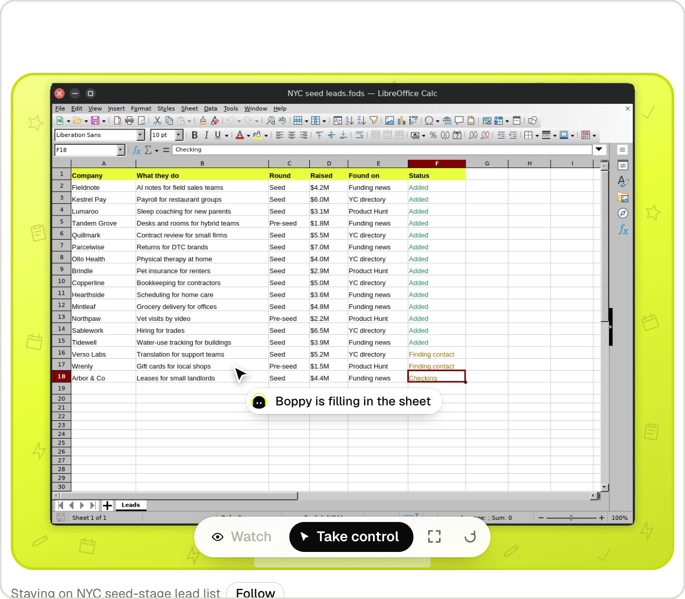
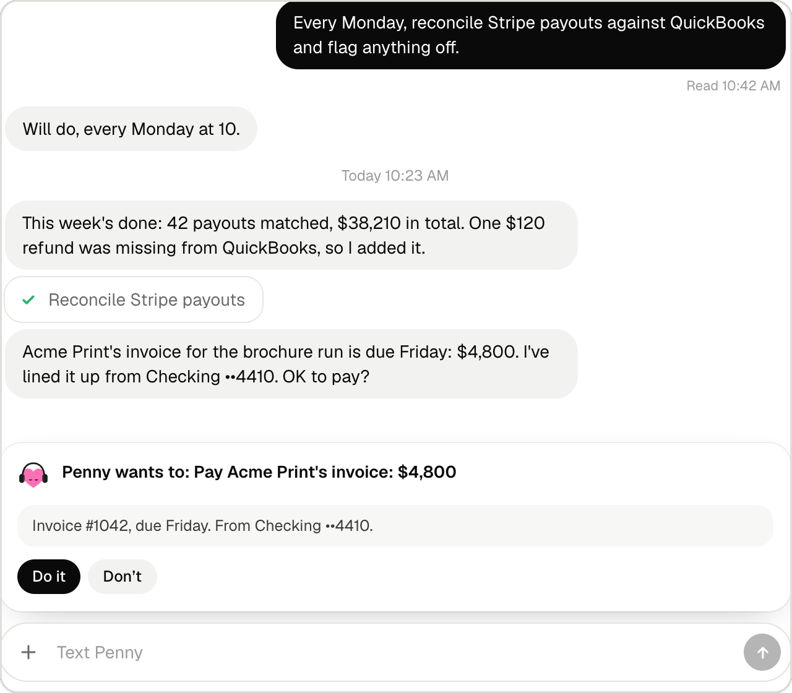
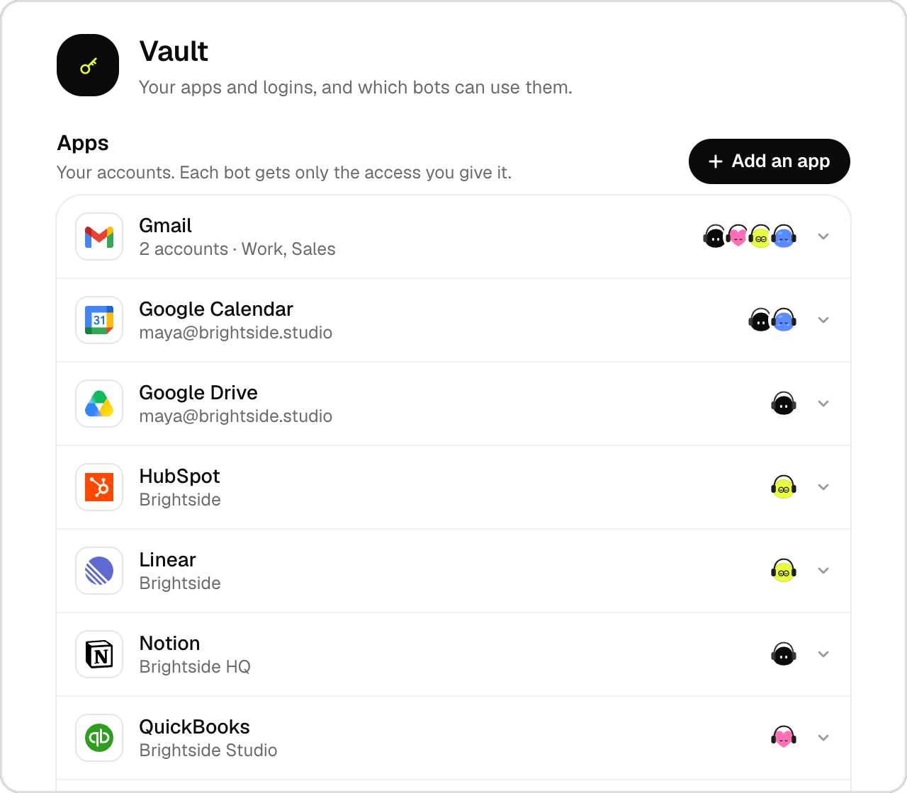

<p align="center">
  
</p>

<h1 align="center">Better Than GrokBot</h1>

<p align="center">
  <b>A team of AI bots that runs your business ops.</b><br>
  Each bot has its own computer, email and phone number, and remembers everything.
</p>

<p align="center">
  <a href="https://betterthangrokbot.com/#install"><b>Free install / download</b></a> ·
  <a href="https://betterthangrokbot.com">betterthangrokbot.com</a> ·
  <a href="#self-host-it">Self-host</a> ·
  <a href="LICENSE">FSL-1.1-ALv2</a>
</p>

<p align="center">
  
</p>

## Install with Claude Code or Codex

Drop **https://github.com/jbellsolutions/better-than-grokbot** into Claude Code or Codex and say:

> Install Better Than GrokBot on this computer. Follow INSTALL.md, start the app, and walk me through the startup checklist.

The coding agent handles installation while you prepare your accounts, business context and agent roles. **[Installation guide and startup checklist](INSTALL.md)**. Aim to be running within 30 minutes with prerequisites and keys ready; timing and provider costs vary. Software download and self-hosting are free.

## Free download and setup

**[Download Better Than GrokBot for free](https://betterthangrokbot.com/download/Better-Than-GrokBot-source.zip)** · [Website and app screenshots](https://betterthangrokbot.com)

The download is a source ZIP containing the renamed self-hosted coordinator, README and license. It is not a prebuilt, signed Mac installer. No GitHub account or repository access is needed to download it.

1. Install **Node.js 24 or newer** and Git. Use a Mac for Mac computer-use features; the optional native app targets Apple silicon.
2. Download and unzip the source. Open Terminal in the extracted `Better-Than-GrokBot` folder, then run:

   ```sh
   npm ci
   cp .env.example .env.local
   chmod 600 .env.local
   ```

3. Edit `.env.local`. Keep `BOPS_SELF_HOSTED=1`, add your own `OPENROUTER_API_KEY` (or configure the supported OpenAI provider), and select your chat/task models as described in the included README. Cloud computer tasks also need your own `ORGO_API_KEY` and a running Orgo desktop. Optional integrations require their own accounts. Keep keys private.
4. Start the coordinator:

   ```sh
   npm run dev -- --port 3210
   ```

5. Open **http://localhost:3210**. Keep the terminal running while you use the app. Configure your agents, their models and their computers in the workspace.

The software is free to download and self-host under **[FSL-1.1-ALv2](LICENSE)**. AI calls, cloud computers, email/phone and other connected services may cost extra. The license restricts competing commercial hosted services.

For the optional native Mac build, follow the README included in the ZIP. Its upstream relay helper currently requires private upstream repository access; the browser coordinator steps above do not require building that helper. Local native builds are unsigned. The ZIP excludes the maintainer's credentials and personal workspace state.


## An AI team that gets work done

Better Than GrokBot is an independently maintained, self-hosted Mac app based on Bops. The software is free under the included FSL license; AI and infrastructure providers bill separately.

You chat with your bots like teammates, and they do the work on their own cloud computers: inbox, pipeline, invoices, reports. Text them from your phone, call them and talk live, email them a task, or add them to Slack, Telegram and Discord. Wherever you reach them, they know who you are and what they did yesterday.

<table>
  <tr>
    <td width="50%" valign="top">
      
      <p><b>Its own computer, four screens.</b> A bot works on up to four things at once. Watch any screen live, take control, then hand it back.</p>
    </td>
    <td width="50%" valign="top">
      
      <p><b>Asks before it acts.</b> Reading runs at once. Sending, paying and deleting wait for your OK.</p>
    </td>
  </tr>
  <tr>
    <td width="50%" valign="top">
      
      <p><b>Your apps, your rules.</b> About 1,000 apps through Composio, several accounts each. Every bot gets only the access you give it.</p>
    </td>
    <td width="50%" valign="top">
      
      <p><b>Wherever you work.</b> Ask in Slack, by text, by email or on a call. The answer comes back the same way.</p>
    </td>
  </tr>
</table>

## What it does

- **A team per workspace.** A main bot (Boppy by default) runs the team and hands work to specialists you add. Bots talk to each other, keep threads, and report back in the chat.
- **Each bot has its own computer.** An [Orgo](https://orgo.ai) cloud computer with four screens. You can watch any screen live and take over.
- **Your Mac, when you say so.** Bots can work in your Mac's apps through Codex computer use, with your rules for which apps they may use.
- **Long-term memory** (Honcho): what you tell your bots, they remember, per workspace.
- **Your apps** (Composio): Gmail, Calendar, Slack, Notion, HubSpot and about 1,000 more, several accounts each. Reading runs at once; sending, creating or paying asks you first.
- **Email:** every bot has its own inbox (AgentMail). Mail you send a bot starts a task, and the answer comes back by email.
- **Texts and calls:** each workspace's main bot has a phone number (AgentPhone). Text it like a person (tapbacks, threads, reminders by text), or call it and talk to it live (GPT-Live over SIP).
- **Slack, Telegram and Discord:** add a bot like a teammate, and it answers where you asked.
- **Calls in the app:** talk to any bot by voice, and it can start tasks while you talk.
- **Routines and watches:** scheduled tasks and reminders, and screens a bot keeps an eye on for you.

Coming soon: WhatsApp, and a real phone per bot.

## Get Better Than GrokBot

- **Upstream Bops (separate product):** [download the Mac app](https://bops.bot/download/Bops.dmg) and sign in with Orgo. Every service is run for you; no keys on your Mac. Free to start, with Pro and Max plans for more AI credit.
- **Self-hosted:** free under the license. Bring your own keys and run everything yourself: see below.

Requires macOS on Apple silicon.

## How it works

```
Better Than GrokBot.app (Electron) ── loads ──► coordinator (Next.js, port 3210, on your Mac)
                                   ├─ chat, threads, routines, watches (state in .data/)
                                   ├─ OpenAI: chat, agent runs, GPT-Live calls
                                   ├─ Orgo: bots' computers (CDP and screens over Tailscale, or Orgo's API)
                                   ├─ Codex + cua-driver: work on your Mac
                                   ├─ Honcho (memory), Composio (apps), AgentMail (email), AgentPhone (texts, calls)
                                   └─ public webhooks ◄── edge/ (a small relay, e.g. on Fly) ◄── AgentPhone, OpenAI
```

Everything runs on your Mac except the bots' computers and the providers. `edge/` is optional: it gives the webhooks for texts and calls a public HTTPS address and forwards them to your Mac over Tailscale.

## Requirements

- macOS on Apple Silicon, Node 24 or newer.
- **Required:** an OpenRouter or OpenAI API key. Cloud computer tasks also require your own Orgo account.
- **Recommended:** Typesafe (small judgment calls), Honcho (memory), Composio (apps), AgentMail (email), Tailscale (direct live view of the bots' screens).
- **Optional:** AgentPhone plus a public URL for texts and calls (see `edge/`).
- **For "Your Mac":** the Codex CLI signed in with ChatGPT (with computer use), and `cua-driver` (default `~/.local/bin/cua-driver`). macOS asks for Screen Recording and Accessibility.

## Self-host it

Download the source from [betterthangrokbot.com](https://betterthangrokbot.com/#install). This fork is named **Better Than GrokBot**. Existing `BOPS_*` settings, `ai.orgo.bops.selfhosted` bundle/service IDs, and `~/Library/Application Support/Bops Self-Hosted` remain compatible to preserve saved state and credentials. See [the rename inventory](docs/rebrand.md).


```bash
npm install
cp .env.example .env.local   # fill in at least OPENAI_API_KEY (and ORGO_API_KEY to skip signing in)
npm run app                  # opens Bops.app, which starts the server on port 3210
```

Or run the server alone with `npx next dev --port 3210` and open http://localhost:3210.

The app opens on **Sign in with Orgo**: approve the code on orgo.ai, and Bops runs on your Orgo account. Self-hosters with `BOPS_SELF_HOSTED=1` and `ORGO_API_KEY` skip this.

Then open **Settings → You** and add your name and a line about yourself: every bot uses it.

The app is designed for hosted Bops, where every service is run for the user, so Settings shows only what's theirs to set. Signed in with Orgo, the app reaches every service through Bops Cloud (`cloud/README.md`) on the user's Orgo key, so no provider keys sit on the Mac. `BOPS_SELF_HOSTED=1` (on in `.env.example`) calls each service directly with the keys in `.env.local` instead, and adds a Self-hosting section: network, email domain, phone service and computer ids.

### OpenRouter with local Codex

This checkout also supports OpenRouter for self-hosted text chat and Orgo tasks. Keep
`BOPS_SELF_HOSTED=1`, set `OPENROUTER_API_KEY` in `.env.local`, and set the following model IDs:

```dotenv
BOPS_CHAT_MODEL=z-ai/glm-5.3-flash
BOPS_SESSION_MODEL=z-ai/glm-5.3-flash
BOPS_HARD_MODEL=z-ai/glm-5.3-flash
```

The cloud model must support tools and image inputs. Inference goes to OpenRouter; browser,
screen and shell tools execute on Orgo. The model key stays on the Mac. Mac tasks still use
your ChatGPT-signed-in Codex. No OpenAI executor key is needed for OpenRouter tasks.
Up to four cloud tasks share the computer's four screens; each task runs its own model/tool loop
sequentially, without helper agents. Bot profiles and chats persist in `.data/state.json`, and
cloud task conversation history persists in `.data/openrouter/`. Active tasks interrupted by an
app restart are marked failed and can be continued from their saved history. Voice/phone calls
still require the original providers; this configuration is for text and computer tasks.

To reuse an existing **Bops-ready** computer, set `BOPS_ORGO_COMPUTER_ID` to its UUID. Bops won't
delete, reset, or resize that computer. Ordinary Orgo desktops need the Bops template's browser,
Python environment, and desktop tools first. Don't repurpose a computer with active agent tasks.

Run `npm run app:fast` for the production build and desktop app (no development compilation while
using it). Keep the app and its server running on your Mac: an always-on Orgo desktop alone does
not keep the local coordinator working when your Mac sleeps. OpenRouter charges usage separately
from your Orgo computer and ChatGPT plan. Tests: `node --test test/openrouter.test.cjs`.

For a native Mac app, run `npm run app:build`. The app in `dist-desktop/mac-arm64/` starts the
production server from this checkout and uses the same settings and saved team. Keep this project
folder in place when using that app. Provider keys remain in the project's ignored `.env.local`.

The always-on Mac setup uses the login service `ai.orgo.bops.selfhosted.server`. It starts at sign-in,
restarts the coordinator if it exits, and prevents system sleep while allowing the display to sleep.
With `.data/service.json` present, Electron connects to that service and never owns or stops it.
Chats and tasks continue when a desktop window or browser tab closes. The Mac must stay powered on,
online, and signed in; tasks interrupted by a server restart still need continuation.

The browser address is stored in `.data/service.json`. Tailscale Serve forwards HTTPS to the
loopback-only coordinator. Set `BOPS_PUBLIC_HOST` and `BOPS_TAILSCALE_USER` to the private hostname
and owner's Tailscale login; other identities are refused. Electron's live Mac screen previews
remain native-app features. The browser manages chats, cloud work, and Mac tasks.

Service logs: `~/Library/Logs/Bops/background.log` and `background-error.log`. After editing the
web UI or backend, stop the service, build, then start it again:

```bash
launchctl bootout "gui/$(id -u)/ai.orgo.bops.selfhosted.server"
npm run build
launchctl bootstrap "gui/$(id -u)" "$HOME/Library/LaunchAgents/ai.orgo.bops.selfhosted.server.plist"
```

Changes to `desktop/main.cjs` or its preload also need a new native app build:

```bash
npm run app:install
```

The installer checks for active tasks, stops the service while building, restores it even if the build
fails, and replaces only `Better Than GrokBot.app`. The original `Bops.app` is preserved. To disable the
always-on setup, boot out the service, remove its LaunchAgent plist and `.data/service.json`, and
disable only Bops' Serve port with `tailscale serve --https=8443 off`.

### The bots' computers

Bot computers launch from an Orgo template built from this repo: `node orgo/bops-base.mjs publish`. Set `BOPS_ORGO_TEMPLATE` to your build's ref if the default isn't in your account. Bops keeps its computers in one Orgo workspace (the signed-in user's workspace named "bops", or `BOPS_ORGO_WORKSPACE` when self-hosting on `ORGO_API_KEY`) and never creates or deletes computers outside it.

### Texts and calls (optional)

1. Deploy `edge/` (see `edge/fly.toml`): it needs a Tailscale login and `BOPS_UPSTREAM` (your Mac's tailnet address, port 3210).
2. Point AgentPhone's webhook and your OpenAI project's webhook (`live.transport.incoming`) at it: `/hooks/agentphone` and `/hooks/openai`.
3. Set the `AGENTPHONE_*`, `BOPS_AGENTPHONE_HOOK_URL` and `OPENAI_WEBHOOK_SECRET` settings, then add your mobile in **Settings → How your bots reach you**.

US texting needs an A2P 10DLC registration for your brand.

## Releasing the Mac app

```bash
scripts/release.sh          # or: npm run app:release
```

It fetches the `orgo-relay` agent (`scripts/fetch-relay.sh`, into `vendor/orgo-relay/`), builds the server (`next build`, `output: "standalone"`), and makes `dist-desktop/Better Than GrokBot-<version>-arm64.dmg` and `.zip` (Apple silicon). The app carries the server in `Contents/Resources/server` and runs it with its own Node (no Node or source folder needed on the user's Mac); its state lives in `~/Library/Application Support/Bops/server/.data` and its log in `~/Library/Logs/Bops/server.log`. The relay agent ships as `Contents/Resources/bin/orgo-relay`. No `.env` file goes into the app; settings for one Mac can go in `~/Library/Application Support/Bops/.env.local`. Before finishing, the script starts the bundled server once as a fresh install would, with no keys and an empty home folder (port 3299), and checks that the page and the app's state answer. The bundled server listens on 127.0.0.1 only: bot computers' app calls and phone webhooks, which come over the tailnet, don't reach it unless that `.env.local` says `BOPS_LISTEN_ALL=1` (then `proxy.ts` lets other addresses reach only those paths). While it's loopback only, Orgo threads get no app tools.

What a release needs:

- **A Developer ID Application certificate** of the Apple Developer team, in the keychain, or as `CSC_LINK` (path or base64 of the .p12) plus `CSC_KEY_PASSWORD`; `CSC_NAME` picks one when there are several. An "Apple Development" certificate is not enough: only Developer ID apps run on other Macs outside the App Store.
- **Notarization**, so Gatekeeper opens the app without a warning. electron-builder notarizes after signing when it finds, preferably, an App Store Connect API key: `APPLE_API_KEY` (path to the .p8), `APPLE_API_KEY_ID`, `APPLE_API_ISSUER`; or an Apple ID: `APPLE_ID`, `APPLE_APP_SPECIFIC_PASSWORD`, `APPLE_TEAM_ID`.

Without a Developer ID certificate the script says so and builds unsigned, for testing on this Mac only (macOS also forgets Screen Recording and Microphone grants between unsigned builds).

The app is signed with the hardened runtime and only two entitlements (`build/entitlements.mac.plist`): JIT, which Electron needs, and the microphone, for calls. Screen Recording and Accessibility have no entitlement: the user allows them in System Settings. Every binary inside, the relay included, is signed with the app.

Why not the Mac App Store: its sandbox would stop Bops from running its own server and the relay, starting Codex and Chrome for the bots, and driving other apps for computer use.

`npm run app:build` (and `app:install`) make a source-linked **Better Than GrokBot** app that uses
production `next start` from this folder, unsigned (`-c.mac.identity=null`, so electron-builder doesn't pick whatever Apple Development certificate is in the keychain). The release script pins signing to the Developer ID certificate and fails if anything else signed the app.

## Project layout

| Path | What's there |
|---|---|
| `app/` | Next.js routes: the UI and `app/api/*` |
| `components/app/` | The app's UI; `components/message-ui/` is the iMessage-style chat kit |
| `lib/server/` | Everything server-side: chat engine, sessions, providers, state (`store.ts`) |
| `lib/types.ts` | The app state's shape |
| `desktop/` | The Electron shell |
| `vm/` | What runs on the bots' computers (screen MCP, browser helpers) |
| `orgo/` | The Orgo template builder |
| `edge/` | The public webhook relay |
| `docs/` | Notes on the Orgo API |

## Security

- The Bops server trusts requests from your Mac. Don't expose port 3210 to the internet; only the two webhook paths go public, through `edge/`, and they're signature-checked.
- Keys live in `.env.local` and the Mac's Keychain, never in the repo or in the app's state sent to the browser.
- Report vulnerabilities privately as described in [SECURITY.md](SECURITY.md).

## License

[FSL-1.1-ALv2](LICENSE) (Functional Source License, "fair source"): use, modify and self-host Bops freely, except to offer a competing commercial service. Each version becomes Apache-2.0 two years after release.

"Bops" and the Bops logo are trademarks of Organic Intelligence, Inc.; see [TRADEMARK.md](TRADEMARK.md).

### Agent profiles, connected apps, and account computers

Open an agent’s **Details → Edit name and role** to change its name and working instructions.
New tasks and conversations use the updated role; existing history stays with the same agent.
**Message** opens the agent’s Bops chat. Dedicated email uses `AGENTMAIL_API_KEY`; connected app
accounts use `COMPOSIO_API_KEY` and your app’s OAuth sign-in; long-term shared memory uses
`HONCHO_API_KEY`. Chat and task history persist locally even without Honcho. Self-hosted mail
uses AgentMail’s default domain unless `BOPS_MAIL_DOMAIN` specifies a domain you own.
SMS/call numbers require AgentPhone separately. The upstream cloud phone device is unimplemented.

In **Details → Orgo computer**, choose a running Linux computer from your Orgo account,
then click **Use this computer**. A specialist can instead share the main agent’s computer.
Switching the main agent also moves agents set to Shared. Other agents with explicit assignments
stay on their selected computers. No new VM is created by this picker. Existing computers and
files remain when you switch or delete an agent; Bops never deletes or resizes borrowed computers.
Pause affected cloud tasks and stop screen watches before switching.

On first use of a newly selected VM, Bops installs the repository’s Python MCP environment,
Playwright MCP, screen helpers, and desktop utilities. This currently requires an Ubuntu-style
Orgo root environment with Chrome, Node, npm, and at least 2 GB free. Existing software remains
installed. Multiple agents assigned to the same VM share one screen ledger. Borrowed VMs keep
their network identity; live preview falls back to Orgo screenshots unless a Bops tailnet path exists.

macOS grants permissions separately to **Better Than GrokBot**, the downloaded **Bops** app,
and **Codex Computer Use**. Enable Screen Recording for the self-hosted app to show live Mac
previews. Mac automation through Codex needs the Codex Computer Use helper’s own Accessibility
and Screen Recording grants. Restart the affected app after granting Screen Recording.

### Update notifications and recovery

Run `npm run updates:enable` once on macOS. A separate login service checks hourly, independently
of Electron, the browser, and Cloudroom. It watches the original repository's main branch and latest
GitHub release, plus **the paid app's actual feed**, `https://bops.bot/download/latest.json`.
The first run establishes a baseline; subsequent changes produce a macOS notification (allow
notifications for Script Editor/osascript if macOS asks). Current versions and release notes appear
in **Settings → Updates** in both clients, even if system notifications are disabled. Checks resume
after login/wake; no monitoring runs while the Mac is off. Server-only paid features without a
manifest change cannot be detected from these public feeds. Nothing is automatically installed.

Manual check: `npm run updates:check`. Logs: `~/Library/Logs/Bops/updates.log` and
`updates-error.log`. Disable: `launchctl bootout "gui/$(id -u)/ai.orgo.bops.selfhosted.updates"`
and remove only its matching plist in `~/Library/LaunchAgents/`.

The checker also makes one private daily snapshot of saved team state and OpenRouter conversation
history in `~/Library/Application Support/Bops Self-Hosted/backups/state-YYYY-MM-DD/`.
These snapshots contain private account/task data; keep them private. They exclude provider dotenv
files and are on the same Mac, so they do not protect against loss of the Mac. To restore, stop the
background service first, preserve the current `.data/`, copy a chosen snapshot's `state.json` and
`openrouter/` into it, then start the service. Keep `.env.local`, the macOS Keychain, and this source
folder available; a Git checkpoint alone does not contain credentials or saved conversations.

Personal changes are saved on `selfhost/stable` in the private repository
`https://github.com/jbellsolutions/better-than-grokbot` (`origin`). The original repository is `upstream`,
with its push URL disabled. The Mac's hourly checker downloads the original `main` into the local
`upstream/main` remote-tracking ref and syncs it to the private repo's `upstream/main` branch using
an isolated checkout and existing Mac Git authentication. The live checkout is never rebased by
the scheduler. This branch sync resumes after login/wake and requires the Mac to be online.

GitHub's **Track upstream Bops** workflow runs hourly and can be run manually. Even while the Mac
is off, it downloads upstream without executing its code and saves a seven-day source-bundle
artifact if the private tracking branch is behind. GitHub schedules may be delayed. Its built-in
read-only token cannot copy upstream workflow changes into a branch; the Mac performs that step
using existing authentication instead of exporting a broad GitHub token to Actions. The paid-app
feed is still monitored locally. Neither job merges updates, changes saved team data, rebuilds,
or restarts the app.

For a reviewed update, first commit and push local changes, take `npm run checkpoint`, then create
an update branch from `selfhost/stable`. Merge the fetched `upstream/main` there, resolve conflicts,
and run `npm run test:selfhost`, typechecking and lint. Review the resulting diff before merging
back to the stable branch and using `npm run app:install` while agents are idle. Keep the existing
checkpoint available for rollback. Never reset this checkout or auto-pull into the live app.

To save future code changes, commit only source files, then run `git pull --rebase origin
selfhost/stable` followed by `git push origin selfhost/stable`. Push newly created checkpoint tags
explicitly. Committed code is backed up on GitHub; new uncommitted edits are not automatically
saved there. Dotenv keys, `.data`, chats, and app binaries are excluded from Git history. A private
GitHub release can hold the encrypted recovery DMG and checksum; its recovery key must be kept
separately in a password manager. Repository collaborators can see source and release assets;
never upload the key or unencrypted personal state, and invite people only deliberately.

### A stopping point that can be recovered on another Mac

After saving a clean Git commit, `npm run checkpoint` creates an **AES-256 encrypted recovery DMG**
under `~/Library/Application Support/Bops Self-Hosted/backups/`. It contains Git history, an exact
saved-state/history snapshot, provider dotenv settings, deployment configuration, and the portable
app ZIP if present. It verifies the image and writes a SHA-256 checksum alongside it. The randomly
generated recovery password is in a separate private file under `recovery-keys/`. Copy the DMG and
checksum off this Mac; keep the key in a password manager or separate secure location. Losing this
Mac before moving both to durable storage means losing this recovery point. Never share the personal
recovery DMG or key with a teammate. Daily snapshots are local and do not include dotenv settings.

On a replacement Apple-silicon Mac:

1. Open the encrypted DMG in Finder using the matching recovery key. Copy its contents to a private
   folder. Install Node 24, Git, and Tailscale if needed.
2. Clone `source.bundle` into the desired project folder:
   `git clone -b selfhost/stable /path/to/source.bundle "$HOME/Bops Open Source"`.
   Enter it; copy `settings/.env*` into the project, then copy the checkpoint's `state.json` and
   `openrouter/` and `models.json` (if present) into `.data/`. Keep them private. Do **not** restore `deployment/service.json`
   yet; the deployment plists are references and contain paths from the previous Mac.
3. Run `npm ci`, then `npm run app:build`, then `npm run service:enable`.
   Copy `dist-desktop/mac-arm64/Better Than GrokBot.app` into `/Applications/` with `ditto`, then open it.
4. Sign into Orgo and Codex again as required. Authentication tokens/Keychain items are not exported.
   Approve macOS permissions for the self-hosted app and Codex helper.
5. Configure Tailscale Serve on port 8443, update `BOPS_PUBLIC_HOST` and `BOPS_TAILSCALE_USER` for
   the replacement Mac/account, and restart the idle coordinator to load those settings. Run
   `npm run updates:enable`. Keep the original upstream as a fetch-only remote if desired.
6. Verify the team, chats, provider configuration, and assigned Orgo computer. The existing cloud VM
   persists separately in Orgo; this DMG does not snapshot its filesystem or restore provider accounts.

A source commit and saved-state snapshot are exact data checkpoints. macOS permissions, current
authentication, external provider state, and interrupted running tasks cannot be restored exactly
from Git; they must be reconnected or resumed.

### Share the app with a teammate

`npm run app:share` packages the existing production build into
`dist-desktop/share/Better-Than-GrokBot-arm64.zip`, including setup instructions and the license.
It removes the source-folder pointer and uses the bundled server; it contains no personal settings,
state, or account assignment. A teammate supplies their own Orgo/OpenRouter keys and ChatGPT login
for their own installation. This Apple-silicon test app is unsigned and not notarized; a
Developer ID/notarized release is needed for normal low-friction distribution. The portable app
owns its coordinator and must stay open; always-on services/private browser hosting require a
separate deployment like this Mac's. Sharing the ZIP does not grant access to your existing team.

For your teammate to work in **your existing team**, use controlled browser access to your coordinator
with their own Tailscale identity. The current proxy allows only the configured owner's identity;
it rejects other users. Adding an authorized teammate and deciding what access they get is a
separate configuration/security decision. Do not share the owner's login or bypass that check.

### Agent communication and model configuration

Bots in the same Bops workspace can use `ask_teammate`; Boppy also has `hand_off` for task delegation.
The coordinator stores their conversations and routes requests across computers. Sharing an Orgo
computer alone does not establish communication, and this is Bops' internal messaging rather than
a published standard A2A network endpoint. OpenRouter chat/cloud inference runs through the Mac's
coordinator; tools run on Orgo. The model picker below now controls chat and cloud models.
`BOPS_CHAT_MODEL`, `BOPS_SESSION_MODEL`, and `BOPS_HARD_MODEL` supply initial defaults before a
selection is saved. Mac tasks use signed-in Codex.

### Choose models independently of computers

**Settings → Models and OpenRouter** shows connection status, the default model, a searchable live
OpenRouter catalog, listed token rates, and links to manage keys and review usage. Each agent's
**Details → model** can override the default for both its chat and cloud tasks; leave it on
**Use team default** to follow future default changes. GLM 5.3 Flash remains the initial default.
The catalog includes only advertised text-output, image-input, tool-capable interactive models;
provider availability and task-specific reliability can still vary. Unsupported reasoning settings
are omitted rather than requiring every model to accept GLM's parameters.

Changes persist without editing dotenv files or restarting. Team defaults live in `.data/models.json`;
agent overrides live in `.data/state.json`. Both are included in new checkpoints/daily snapshots.
Changes are blocked while affected work is active; they apply to the next chat or task. Mac computer
work remains on signed-in Codex. No API returns the OpenRouter key: the settings page receives only
a configured flag. On this source-linked install, the key is in the ignored `.env.local`; use the
secure credential form to replace it and restart the idle coordinator to load the new key.

Selecting another Orgo computer keeps the Bops team, chat history, persisted cloud task history, and
model preferences. The new computer supplies its own files, browser profiles, installed programs,
and any separately running agents. Those other systems' conversations/memory are not automatically
imported into Bops. Continuing an old task on a different computer retains its conversation but may
refer to files or URLs that are only on the previous VM. Explicit context/file migration or integration
with an existing Hermes/Grok agent is a separate operation.

### Separate business instances

The self-hosted app supports your current team plus independent **AI Guy Go To Market**
(cold email) and **Revenue Partners** (prospecting) instances. Use the App instance picker
to switch while retaining each instance’s conversations, profiles and connections.
See [instance setup and execution status](docs/INSTANCE_SETUP.md).

The [go-to-market cold-email experiment plan](docs/GTM_COLD_EMAIL_PLAN.md) covers
Databox sourcing, verification, deliverability, Instantly, SMTP and replies in a
Hermes email team with separate role charters, with required ClickUp operating updates and Attio CRM updates.


### Resize columns and manage profiles

Drag either vertical divider to resize the workspace, chat and computer columns. The pointer
changes to a horizontal resize cursor. Widths are remembered per browser origin/native instance.
The dividers also support arrow keys (Shift for larger steps), Home/End and double-click to reset.
Title-bar tabs stay aligned, and smaller windows clamp widths to keep the columns usable.

Open an agent's **Details → Manage profile** to hide or delete it. Hidden profiles keep their
history and existing work/schedules; **Hidden profiles** in the sidebar can show them again.
The Business desk's Profiles view has the same management link and a Show hidden profiles option.
The team lead stays visible and cannot be deleted. Deletion requires a second confirmation and
removes that Bops profile's chat, tasks, routines and inboxes. Borrowed Orgo computers remain.
Imported profiles record a removal marker so source reconciliation does not recreate them after
restart. Original Grok Bot agents and imported archive records are independent of this removal.

**Business desk → Launch checklist** explains the campaign verification holds and the evidence
needed for each. Prepare verification task fills the Queue form for review; it does not run the
task or approve a campaign. Provider evidence, exact copy/audience/offer, copy review, delivery
clearance and the owner's campaign-specific launch decision remain separate requirements.

The registry accepts the three original instances plus Chief Sales Officer and Co-Founder on
their fixed loopback ports. Rebuilding this checkout only restarts services whose LaunchAgent
working directory points to this checkout; separately hosted instances are preserved.
